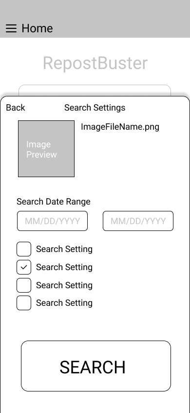

# User Experience Design

This repository contains instructions and files for two assignments that together comprise the user experience design phase of a web app.

Replace the contents of this file with the completed assignments, as described in:

-   [app map & wireframe instructions](instructions-0a-app-map-wireframes.md).
-   [prototype instructions](instructions-0b-prototyping.md)

## Prototype 

[Link to Figma prototype](https://www.figma.com/proto/pOIY8taJcRZ2iZLnCulYut/RepostBuster-Wireframe?node-id=2%3A2&scaling=scale-down&page-id=0%3A1&starting-point-node-id=2%3A2)

## Site/App Map

## Wireframe

### Home Page
> Home Page for the RepostBuster Web app. Opening the app will always bring the user here first.

> Here the user can either perform a reverse image search or navigate the site via the drop down menu. 

> When Performing a reverse image search, the user can either upload an image by clicking the "Upload an Image" button or enter the web URL of the image they would like to perform the reverse image search on. 

### Uploading an Image
> This tab pops up when the user selects the "Upload an Image" button. Here the user can select an image on their device to perform a reverse image search on.
 

> Clicking "Next" proceeds the user to the Search Settings page. "Close" closes the current "Upload Image" Tab. 

### Search Settings
> This tab allows the user to select certain search parameters and filters for the reverse image search of the image they chose in the previous tab.
 

> Once the user is ready to perform the reverse image search, they can click the "SEARCH" button at the bottom of the page.

>If users want to go back to the previous tab, they can select the "Back" button.

### Search Results
> Once RepostBuster finishes performing its reverse image search, the web-app will return this results page to the  user. 

> This page will return a naviatable list of all the relevant matches the web-app finds based on the originally uploaded image. 

> The user will also have the option to download the entire list of results (csv, txt, etc.) or perform another reverse image search. 

### Menu Navigation
> This is the menu navigation drop down that appears when the user selects the menu hamburger on the header. This is the same across the entire site.

### About Us
> About page for RepostBuster.

### Help Center - How it Works
> Descibes how RepostBuster works to unfamiliar users in an easy to understand way.

### Help Center - FAQ
> Frequently Asked Questions page for RepostBuster

### Help Center - Contact
> Contact page for RepostBuster

### Our Technology
> Describes the Tech-Stack for RepostBuster

